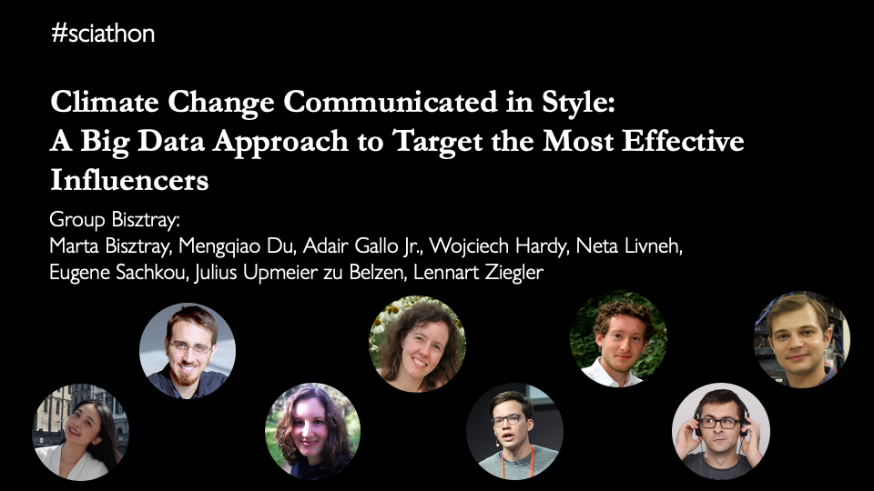
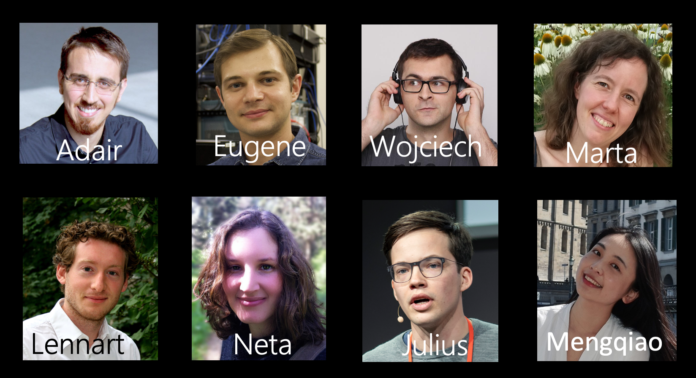

# c3s
Communicating Climate Change in Style 🌍🌎🌏

# 

| Work in progress. This repo is based on a 48 h sciathon and therefore not perfect (yet) |
|---|

## Vision

We want to help communicate relevant science on climate change as efficient as possible.

Check out short video on the project: 

## Next Steps

- Improve modularity and reliability of the code
- Add a distinction between climate change sceptic and climate change positive tweets
- 

## What can I do?

**If you are working on communicating climate change** - let us know about your work, contribute your expertise to the project by commenting on the issues below 

**If you are a programer** - help us improve the tool. Contribute ideas by raising issues and commenting on the potential projects. Get to work on the implementation of important features. 
<!-- # TODO: link issue here -->

**If you have questions or suggestions on the project** - reach out to us on twitter: @juzb, 
<!-- #TODO: add your handles, if you're fine with that -->

## What to communicate?

We'd  like to have a discussion about this and hear from you! 
Check out our issue  <!-- TODO: link issue here -->
Help us to figure out
- what are the most urgent messages to convey
- what is the the scientific evidence

## How to communicate?

We'd  like to have a discussion about this and hear from you! 
Check out our issue <!-- TODO: link issue here -->
Help us to figure out
- who needs to hear the messages the most
- how the message should be conveyed to it reaches open ears

# Using the c3s tool

We want to make using our tool as simple as possible. In fact, you can start right now in a colab notebook or locally:

## Colab:
<!-- #TODO: figure out how to make the colab notebook run the newest version from github -->

## Locally:
<!-- Hyperlink all of these -->
1. clone this repository
2. install conda
3. create a conda environment with `tweepy` in `python3`
4. get credentials for the Twitter API
5. run the [notebook](code/sciathon_notebook.ipynb)

## Attributions

This project started off with team Bisztray in the Lindau Nobel Laureate Metings Sciathon 2020:

We are honored to have won the first prize in the sicathon's communicating climate change section amongst many great projects!

Many thanks to the fantastic team of the Lindau Nobel Laureate meetings for the organisation of the sciathon and the open science days 2020. 